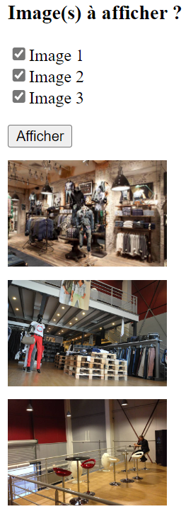

# Exercice Bibliotheque d'images  

1° - Faites un Fork de ce Repository GitHub.  
2° - Mettre en ligne votre code et observez le résultat.  
3° - Modifiez votre code afin d'obtenir le résultat suivant :   
  
**Resultat attendu**  
L'utilisation choisi via les cases à cocher les images à afficher  
Il clique ensuite sur le bouton "Afficher" pour afficher les images selectionnées.  
